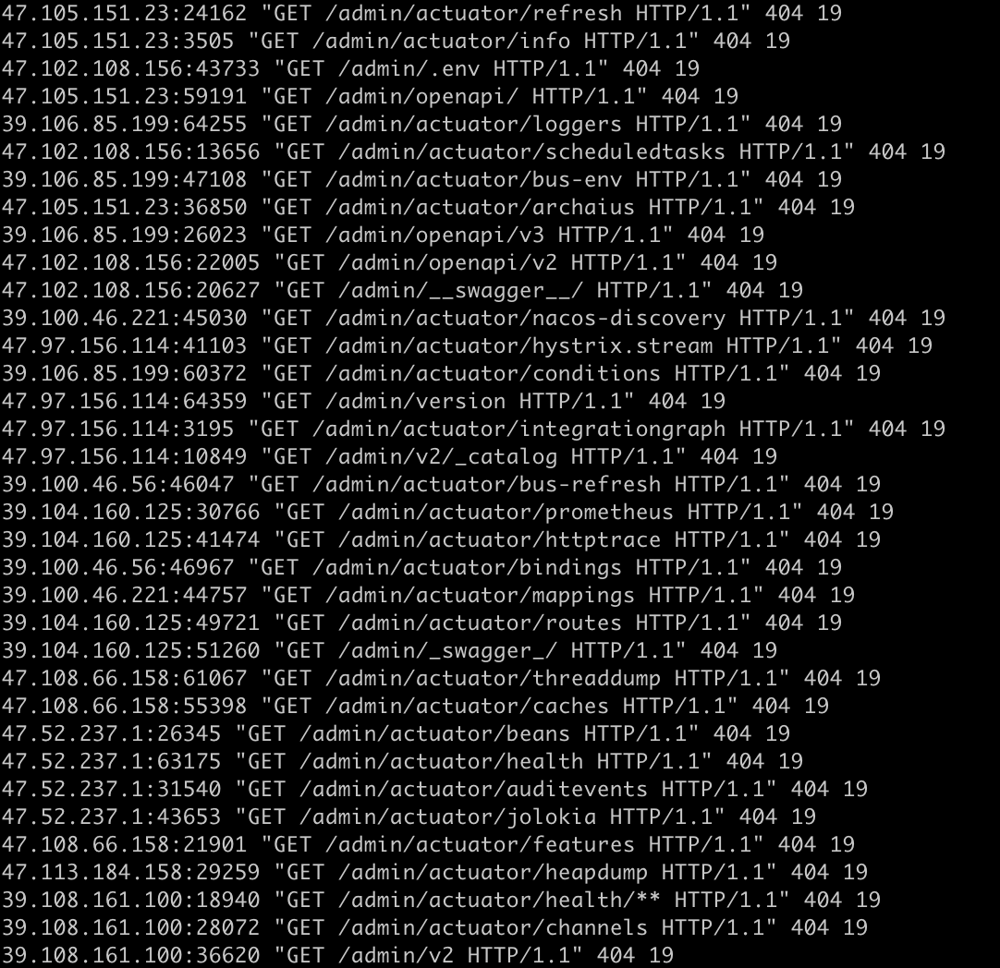

# 准备
获取阿里云 ak,aks
https://usercenter.console.aliyun.com/?spm=api-workbench.API%20Explorer.0.0.7fd91e0fT7ahK0
修改 fireproxycn.py 247,248行

安装阿里云SDK
`pip install alibabacloud_cloudapi20160714==2.2.5`

安装haproxy
`brew install haproxy`

# 使用
## 查看所有 api
python3 fireproxycn.py --command list 
## 删除 fireproxycn 组下所有api, 创建 api gateway 之前需要先删除 fireproxycn 组下所有api
python3 fireproxycn.py --command delete -all 
## 创建 api gateway
python3 fireproxycn.py --command create --url https://www.example.com/admin/ 

## 运行负载均衡
`haproxy -f haproxy.cfg` haproxy.cfg 见创建 api gateway命令行输出

